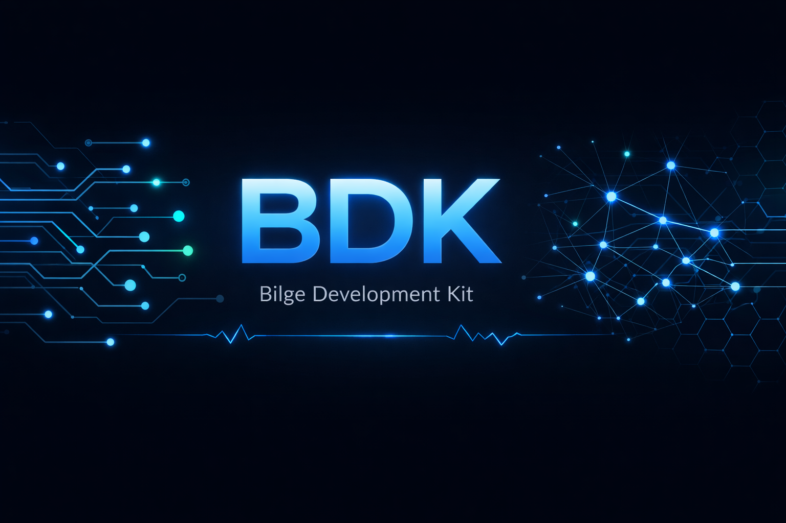

<p align="center">
  
</p>

<p align="center">
  
  
  
  
  
  
  
  <br>
  
  
  
  <a href="https://buymeacoffee.com/bilgeai"></a>
</p>

<p align="center"><strong><a href="README.en.md">English</a> | <a href="README.md">Türkçe</a></strong></p>

# Bilge Development Kit (BDK)

**Tek bir AI assistant'ı, 22 uzmandan oluşan bir geliştirici ekibine dönüştürün.**

BDK, Claude Code ve Gemini gibi AI coding assistant'larına uzman davranışları, otomatik güvenlik korumaları ve yapılandırılmış iş akışları kazandıran modüler bir toolkit'tir. Hiçbir runtime dependency'si yoktur -- tamamı markdown dosyaları ve shell script'lerden oluşur. Projenizin `.agent/` dizinine kopyalayın, AI assistant'ınız artık hangi uzmanı çağıracağını, hangi kuralları uygulayacağını ve hangi güvenlik kontrollerini yapacağını bilir.

```
22 Agent | 56 Core Skill | 37 Extra Skill | 20 Slash Command | 4 Hook | 5 Rule | 3 Context
```

---

## Table of Contents

- [Neden BDK?](#neden-bdk)
- [Quick Start](#quick-start)
- [Mimari](#mimari)
- [Agent'lar (22)](#agentlar-22)
- [Skill'ler (56 Core + 37 Extra)](#skilller-56-core--37-extra)
- [Slash Komutları (22)](#slash-komutları-22)
- [Hooks -- Otomatik Korumalar (4)](#hooks----otomatik-korumalar-4)
- [Memory Bank](#memory-bank--sessionlar-arası-hafıza)
- [Always-On Kurallar (5)](#always-on-kurallar-5)
- [Context Modları (3)](#context-modları-3)
- [Script'ler (5)](#scriptler-5)
- [MCP Konfigürasyonu](#mcp-konfigürasyonu)
- [Nasıl Çalışır?](#nasıl-çalışır)
- [Özelleştirme](#özelleştirme)
- [Gereksinimler](#gereksinimler)

---

## Neden BDK?

AI coding assistant'lar güçlüdür ama jeneriktir. "React component yaz" dediğinizde çalışan bir kod üretir -- ama projenizin stil kurallarını bilmez, güvenlik açıklarını kontrol etmez, test yazmayı unutabilir ve `rm -rf /` komutunu sorgulamadan çalıştırabilir.

BDK bu boşluğu doldurur:

**Jenerik assistant yerine uzman ekip.** Her istek otomatik olarak doğru uzmana yönlendirilir. Frontend görevi? `frontend-specialist` agent'ı devreye girer ve `react-best-practices`, `tailwind-patterns` gibi domain-specific bilgiyi yükler. Güvenlik taraması? `security-auditor` OWASP checklist'ini uygular.

**Kodlamadan önce düşünme.** Karmaşık isteklerde Sokratik Kapı devreye girer: "E-commerce sitesi yap" derseniz, Claude önce mimari kararları netleştirmek için sorular sorar. Tek satıcı mı çok satıcı mı? Ödeme yöntemi ne? Minimum 3 soru, cevap almadan kodlama yok.

**Otomatik güvenlik ağı.** Hooks sistemi arka planda çalışır: dosyalara yazılan secret'ları yakalar, yıkıcı komutları engeller, her düzenlemeden sonra lint kontrolü yapar. Siz fark etmeden.

**Tutarlı kalite.** Always-on kurallar her kod çıktısına uygulanır: Conventional Commits formatı, camelCase/snake_case tutarlılığı, %80 test coverage hedefi, Core Web Vitals limitleri. Agent değişse bile standart değişmez.

---

## Quick Start

### 1. Projenize ekleyin

**Tek komutla kurulum (önerilen):**

```bash
git clone https://github.com/bugrabilge/bilge-development-kit.git
bash bilge-development-kit/install.sh your-project       # Bash
```

```powershell
git clone https://github.com/bugrabilge/bilge-development-kit.git
.\bilge-development-kit\install.ps1 your-project         # PowerShell
```

<details>
<summary>Manuel kurulum</summary>

**Bash (macOS / Linux / Git Bash):**
```bash
git clone https://github.com/bugrabilge/bilge-development-kit.git
cp -r bilge-development-kit your-project/.agent
cp -r bilge-development-kit/.claude your-project/.claude
```

**PowerShell (Windows):**
```powershell
git clone https://github.com/bugrabilge/bilge-development-kit.git
Copy-Item -Recurse bilge-development-kit your-project\.agent
Copy-Item -Recurse bilge-development-kit\.claude your-project\.claude
```
</details>

### 2. Platforma göre ayarlayın

**Claude Code:** Otomatik çalışır. `.agent/CLAUDE.md` dosyasını otomatik okur. Hooks için `.agent/.claude/settings.json` yerinde olmalıdır.

**Gemini:** `.agent/rules/GEMINI.md` dosyasını projenizin AI ayarlarında referans gösterin.

### 3. Kullanmaya başlayın

```
/onboard                              # Projeyi tanı, CLAUDE.md oluştur, Memory Bank başlat
/brainstorm authentication system     # Farklı yaklaşımları karşılaştır
/plan e-commerce MVP                  # Görev kırılımı oluştur
/create user profile page             # Sıfırdan implement et
/review                               # Kod review yap
/build-fix                            # Build hatalarını otomatik çöz
/security full scan                   # Güvenlik denetimi
```

---

## Mimari

```
.agent/
├── ARCHITECTURE.md              # Sistem haritası
├── CLAUDE.md                    # Claude Code protokol kuralları
├── mcp_config.json.example      # MCP sunucu şablonu
│
├── agents/                      # 22 Uzman Agent
│   ├── orchestrator.md          #   Multi-agent koordinasyon
│   ├── frontend-specialist.md   #   Web UI/UX
│   ├── backend-specialist.md    #   API, iş mantığı
│   ├── security-auditor.md      #   OWASP, zero trust
│   └── ...                      #   +18 uzman daha
│
├── skills/                      # 56 Core Skill (agent-referenced)
│   ├── clean-code/
│   ├── react-best-practices/
│   ├── api-patterns/
│   └── ...
│
├── skills-extra/                # 37 Extra Skill (niş/opsiyonel)
│   ├── langchain-architecture/
│   ├── grafana-dashboards/
│   └── ...
│
├── .claude/
│   ├── settings.json            # Hooks konfigürasyonu
│   └── skills/                  # 20 Slash Command Skill
│       ├── brainstorm/
│       ├── build-fix/
│       ├── onboard/
│       ├── plan/
│       ├── remember/
│       └── ...
│
├── workflows/                   # 17 Workflow Referansı
│   ├── brainstorm.md            #   /brainstorm
│   ├── create.md                #   /create
│   ├── build-fix.md             #   /build-fix
│   ├── remember.md              #   /remember
│   └── ...
│
├── rules/                       # Global Kurallar
│   ├── CLAUDE.md                #   Claude Code kuralları
│   ├── GEMINI.md                #   Gemini kuralları
│   └── common/                  #   Always-on standartlar
│       ├── git-workflow.md      #   Commit formatı, branch naming
│       ├── coding-style.md      #   Naming conventions, dosya organizasyonu
│       ├── testing.md           #   Test zorunlulukları, coverage hedefleri
│       ├── security.md          #   Secret yönetimi, OWASP korumaları
│       └── performance.md       #   Core Web Vitals, bundle limitleri
│
├── contexts/                    # Mod Bazlı Davranış
│   ├── dev.md                   #   Geliştirme modu
│   ├── review.md                #   Kod review modu
│   └── research.md              #   Araştırma modu
│
├── scripts/                     # Otomasyon Araçları
│   ├── hooks/                   #   Guardrail script'leri
│   │   ├── dangerous_cmd_check.sh
│   │   ├── secret_scanner.sh
│   │   ├── lint_check.sh
│   │   └── session_save.sh
│   ├── detect_pm.py             #   Package manager tespiti
│   ├── checklist.py             #   Proje doğrulama
│   ├── verify_all.py            #   Kapsamlı test suite
│   ├── auto_preview.py          #   Dev server yönetimi
│   └── session_manager.py       #   Proje analizi
│
└── .shared/
    └── ui-ux-pro-max/           # UI/UX kaynakları (CSV data)
```

### İstek İşleme Akışı

Her kullanıcı isteği 5 aşamadan geçer:

```
Kullanıcı İsteği
    │
    ▼
[1. Sınıflandırma]  →  Soru mu? Kod mu? Tasarım mı? Araştırma mı?
    │
    ▼
[2. Agent Seçimi]   →  frontend-specialist? backend-specialist? debugger?
    │
    ▼
[3. Skill Yükleme]  →  Agent'ın frontmatter'ındaki skills: listesi okunur
    │
    ▼
[4. Kural Uygulama] →  Always-on rules (güvenlik, stil, test, performans)
    │
    ▼
[5. Hooks]          →  Secret tarama, lint kontrolü, session kayıt
    │
    ▼
  Çıktı
```

---

## Agent'lar (22)

Her agent bir `.md` dosyasıdır. İçinde persona tanımı, uzmanlık alanı, uyması gereken ilkeler ve yüklemesi gereken skill listesi bulunur. İstek geldiğinde BDK doğru agent'ı otomatik seçer -- siz belirtmek zorunda değilsiniz.

| Agent | Uzmanlık | Ne Zaman Devreye Girer |
|-------|----------|------------------------|
| `orchestrator` | Multi-agent koordinasyon | 3+ alanı kapsayan karmaşık görevler |
| `project-planner` | Keşif ve planlama | Yeni proje başlangıcı, görev kırılımı |
| `frontend-specialist` | Web UI/UX | React, Next.js, Tailwind, component tasarımı |
| `backend-specialist` | API ve iş mantığı | Express, FastAPI, veritabanı entegrasyonu |
| `database-architect` | Şema tasarımı | Migrasyon, indexleme, normalizasyon, query optimizasyonu |
| `mobile-developer` | Mobil geliştirme | React Native, Flutter, SwiftUI |
| `game-developer` | Oyun geliştirme | Unity, Godot, Phaser, oyun mekaniği |
| `ai-engineer` | AI/ML mühendisliği | LLM uygulamaları, RAG sistemleri, agent geliştirme |
| `data-engineer` | Veri mühendisliği | ETL pipeline'ları, Spark, dbt, Airflow |
| `devops-engineer` | Altyapı ve operasyon | CI/CD, Docker, Kubernetes, production ops |
| `security-auditor` | Güvenlik denetimi | OWASP, supply chain güvenliği, zero trust |
| `penetration-tester` | Sızma testi | Red team operasyonları, exploit geliştirme |
| `test-engineer` | Test mühendisliği | TDD, unit/integration/E2E test stratejisi |
| `qa-automation-engineer` | Otomasyon testi | Playwright, Cypress, CI entegrasyonu |
| `debugger` | Hata ayıklama | Root cause analizi, crash investigation |
| `performance-optimizer` | Performans | Web Vitals, profiling, bottleneck tespiti |
| `seo-specialist` | SEO optimizasyonu | Ranking, structured data, Core Web Vitals |
| `documentation-writer` | Teknik dokümantasyon | API docs, README, kullanım kılavuzları |
| `product-owner` | Ürün yönetimi ve stratejisi | Gereksinim analizi, backlog, MVP, önceliklendirme |
| `api-designer` | API tasarımı | REST, GraphQL, gRPC şema ve kontrat tasarımı |
| `code-archaeologist` | Legacy kod | Eski kod analizi, modernizasyon stratejisi |
| `explorer-agent` | Codebase keşfi | Derinlemesine kod tarama ve analiz |

### Agent Yapısı

```markdown
# agents/frontend-specialist.md
---
name: frontend-specialist
skills:
  - react-best-practices
  - frontend-design
  - tailwind-patterns
  - web-design-guidelines
---

## Persona
Sen 10+ yıl deneyimli bir senior frontend geliştiricisin...

## İlkeler
1. Component-first düşün: her UI parçası yeniden kullanılabilir olmalı
2. Accessibility (WCAG 2.1 AA) zorunlu, dekorasyon değil
3. Performance budget: LCP < 2.5s, CLS < 0.1
...
```

Bir frontend görevi geldiğinde Claude bu dosyayı okur, `skills:` listesindeki bilgi modüllerini yükler ve o agent'ın persona ile ilkelerini uygulayarak yanıt verir.

---

## Skill'ler (56 Core + 37 Extra)

Skill'ler, agent'ların görev sırasında yüklediği domain-specific bilgi modülleridir. Her skill bir `SKILL.md` dosyası ve opsiyonel `scripts/`, `references/`, `assets/` alt klasörleri içerir. Agent'lar sadece ihtiyaç duydukları skill'leri yükler -- tamamını değil.

### Core Skill'ler (56) — `skills/`

Agent'lar tarafından aktif referans edilen, her projede geçerli beceriler.

| Kategori | Sayı | Örnekler |
|----------|------|----------|
| **Backend & API** | 4 | `api-patterns`, `api-security-best-practices`, `nodejs-best-practices`, `backend-dev-guidelines` |
| **Frontend & UI** | 4 | `react-best-practices`, `tailwind-patterns`, `frontend-design`, `web-design-guidelines` |
| **Testing & Quality** | 8 | `testing-patterns`, `tdd-workflow`, `webapp-testing`, `code-review-checklist`, `lint-and-validate` |
| **Security** | 2 | `vulnerability-scanner`, `red-team-tactics` |
| **Architecture** | 5 | `architecture`, `app-builder`, `plan-writing`, `brainstorming`, `architecture-decision-records` |
| **Code Quality** | 4 | `clean-code`, `refactoring-patterns`, `code-refactoring-tech-debt`, `codebase-cleanup-deps-audit` |
| **DevOps & Infra** | 6 | `deployment-procedures`, `server-management`, `monitoring-observability`, `secrets-management` |
| **Documentation** | 5 | `readme`, `documentation-templates`, `code-documentation-doc-generate`, `writing-skills` |
| **Python** | 3 | `python-patterns`, `python-packaging`, `python-testing-patterns` |
| **Shell/CLI** | 3 | `bash-linux`, `powershell-windows`, `linux-shell-scripting` |
| **Mobile & Game** | 2 | `mobile-design`, `game-development` |
| **SEO** | 2 | `seo-fundamentals`, `geo-fundamentals` |
| **Caching & Perf** | 2 | `caching-patterns`, `performance-profiling` |
| **Agent Behavior** | 3 | `behavioral-modes`, `parallel-agents`, `mcp-builder` |
| **Diğer** | 3 | `rust-pro`, `database-design`, `build-fix` |

### Extra Skill'ler (37) — `skills-extra/`

Niş, framework-spesifik veya ileri düzey beceriler. Varsayılan agent'lar tarafından yüklenmez ama ihtiyaç duyulduğunda `skills/` altına taşınıp agent frontmatter'ına eklenerek aktifleştirilebilir.

AI/LLM araçları (langchain, langfuse, langgraph, rag-engineer, llm-evaluation), ML/Data (ml-engineer, mlops-engineer, data-scientist, airflow-dag-patterns), Monitoring (grafana-dashboards, prometheus-configuration), Agent araçları (agent-memory-mcp, agent-tool-builder, agent-evaluation) ve daha fazlası.

---

## Slash Komutları (22)

Chat'e `/komut` yazarak tetiklenen yapılandırılmış iş akışları. 20 workflow komutu + 3 skill komutu (Claude Code built-in).

### Workflow Komutları

| Komut | Ne Yapar | Örnek |
|-------|----------|-------|
| `/brainstorm` | Bir konu hakkında 3+ farklı yaklaşım üretir. Her opsiyonun artılarını, eksilerini ve effort seviyesini karşılaştırır. Sonunda net bir öneri sunar. Kod yazmaz, karar vermenize yardımcı olur. | `/brainstorm auth system` |
| `/create` | Sıfırdan yeni feature, component veya modül oluşturur. İsteğin domainine göre doğru uzman agent'ı otomatik seçer, gerekli tüm dosyaları yaratır ve tam çalışan bir implementasyon sağlar. | `/create user profile page` |
| `/debug` | Bug'ı sistematik 4 aşamalı süreçle araştırır: semptom toplama, hipotez oluşturma, kök neden analizi, fix uygulama. Log'ları, stack trace'leri ve hata pattern'lerini analiz eder. | `/debug login 500 error` |
| `/deploy` | Deployment sürecini uçtan uca yönetir. Environment kontrolü, CI/CD pipeline hazırlığı, rollback planı oluşturma ve deploy sonrası doğrulama adımlarını kapsar. | `/deploy production` |
| `/enhance` | Mevcut çalışan kodu iyileştirir. Performans optimizasyonu, okunabilirlik artırma veya yeni yetenek ekleme. Mevcut davranışı bozmadan, test'leri kırmadan geliştirir. | `/enhance search performance` |
| `/orchestrate` | 3+ farklı alanı kapsayan karmaşık görevlerde birden fazla uzman agent'ı koordine eder. Planlama → paralel implementasyon → doğrulama fazlarını yönetir. En güçlü komut. | `/orchestrate full-stack auth` |
| `/plan` | Görevi alt görevlere kırar. Her görevin bağımlılıklarını, önceliğini ve tamamlanma kriterlerini belirler. Karmaşık işlere başlamadan önce net bir yol haritası çizer. | `/plan e-commerce MVP` |
| `/preview` | Dev server'ı başlatır, durdurur veya durumunu kontrol eder. Port çakışmalarını yönetir, hot reload desteği sağlar. | `/preview start 3000` |
| `/refactor` | Kodu sistematik yeniden yapılandırır. Extract method, SOLID prensipleri, strangler fig pattern gibi kanıtlanmış teknikleri uygular. Davranışı değiştirmeden iç yapıyı iyileştirir. | `/refactor extract auth service` |
| `/review` | Kapsamlı kod review yapar. Güvenlik açıkları, performans sorunları, stil tutarsızlıkları, test eksiklikleri ve breaking change'leri kontrol eder. Her bulguyu severity seviyesiyle (Critical/Major/Minor/Nit) raporlar. | `/review` |
| `/security` | Güvenlik denetimi uygular. OWASP top 10 taraması, hardcoded secret kontrolü, dependency vulnerability audit, input validation ve authentication/authorization kontrolü. | `/security full scan` |
| `/status` | Projenin anlık durumunu analiz eder. Tech stack tespiti, dosya yapısı haritası, sağlık kontrolü, eksik bağımlılıklar ve konfigürasyon sorunlarını detaylı raporlar. | `/status` |
| `/test` | Test suite'i çalıştırır. Package manager'ı otomatik tespit eder (npm/yarn/pnpm/bun), unit/integration/E2E testleri koşar ve başarısız testleri detaylı raporlar. | `/test unit` |
| `/ui-ux-pro-max` | 50 farklı tasarım stiliyle UI/UX oluşturur. Renk paletleri, ikon setleri, grafik stilleri ve ürün layout'larından oluşan CSV veri tabanlarından ilham alır. 12 farklı tech stack desteği (React, Flutter, SwiftUI, vb.). | `/ui-ux-pro-max dashboard` |
| `/build-fix` | Build ve compile hatalarını otomatik tespit edip çözer. Hata çıktısını parse eder, yaygın pattern'lerle eşleştirir (eksik dependency, type error, import hatası, version conflict) ve fix uygular. Başarısız olursa max 3 iterasyon dener. | `/build-fix` |
| `/onboard` | Projeye ilk kez BDK eklendiğinde tek komutla tam onboarding yapar. Tech stack tespit, dizin yapısı haritalama, key dosyaları özetleme, proje-spesifik CLAUDE.md oluşturma, Memory Bank başlatma ve eksikleri raporlama (missing .gitignore, .env leak, test/CI eksikliği). | `/onboard` |
| `/remember` | Memory Bank sistemi. Projeyi tarayarak pattern'ları, mimari kararları, aktif context'i ve çözülen sorunları kalıcı dosyalara kaydeder. Yeni session açıldığında Claude bu dosyaları otomatik okur — session'lar arası hafıza sağlar. Alt komutlar: `/remember context`, `/remember patterns`, `/remember decisions`, `/remember issues`, `/remember status`. | `/remember` |
| `/audit` | Proje genelinde codebase sağlık analizi yapar. Mimari pattern'lar, bağımlılık riskleri, complexity hotspot'lar ve tech debt envanteri çıkarır. 100 üzerinden Health Score verir. Alt komutlar: `/audit architecture`, `/audit dependencies`, `/audit complexity`, `/audit tech-debt`, `/audit size`. | `/audit` |
| `/create-skill` | Doğal dil açıklamasından yeni slash komutu (skill) oluşturur. Uygun frontmatter, davranış kuralları ve çıktı formatıyla düzgün yapılandırılmış SKILL.md üretir. 250 karakter description budget limitini kontrol eder. | `/create-skill changelog` |
| `/push` | Güvenli push pipeline'ı. Secret taraması, debug statement kontrolü, lint, test doğrulaması (kapsayıcılık dahil), akıllı commit mesajı (Conventional Commits) ve push. Kırık kod ve sızdırılmış secret'ların remote'a ulaşmasını engeller. Alt komutlar: `/push check`, `/push --force`, `/push --amend`. | `/push` |

### Skill Komutları

| Komut | Ne Yapar |
|-------|----------|
| `/brainstorming` | Karmaşık isteklerde otomatik devreye giren Sokratik sorgulama protokolü. Kodlamaya başlamadan önce minimum 3 mimari sonuçlu soru sorar -- her soru bir implementasyon kararına bağlıdır. İleri seviye kullanımda 5 agent'lı (Primary Designer, Skeptic, Constraint Guardian, User Advocate, Arbiter) yapılandırılmış design review süreci başlatır. |
| `/simplify` | Son yapılan değişiklikleri kalite gözüyle tarar: tekrar eden kod blokları, gereksiz karmaşıklık, kullanılmayan import'lar ve verimlilik sorunlarını tespit eder. Bulgu varsa otomatik düzeltir. |
| `/loop` | Bir komutu belirli aralıklarla tekrar çalıştırır. Varsayılan süre 10 dakika. Deploy sonrası monitoring, CI durumu takibi veya periyodik sağlık kontrolü için idealdir. Örnek: `/loop 5m /status` |

---

## Hooks -- Otomatik Korumalar (4)

Hooks, Claude Code'un yerleşik hook sistemini kullanarak arka planda otomatik çalışan güvenlik ve kalite kontrolleridir. Siz bir şey yapmanıza gerek yok -- her dosya yazımında, her komut çalıştırmasında ve her session sonunda devredeler.

Konfigürasyon: `.agent/.claude/settings.json`

| Hook | Olay | Tetikleyici | Ne Yapar |
|------|------|------------|----------|
| `dangerous_cmd_check.sh` | PreToolUse | Bash komutları | `rm -rf /`, `git push --force`, `DROP TABLE`, `git reset --hard` gibi geri dönüşü olmayan komutları tespit eder ve çalıştırılmadan **engeller**. |
| `secret_scanner.sh` | PreToolUse | Write, Edit | Dosyaya yazılmak üzere olan içerikte AWS Access Key, OpenAI API key, GitHub PAT, Stripe key, JWT token gibi 15+ secret pattern'i tarar. Eşleşme bulursa **engeller**. |
| `lint_check.sh` | PostToolUse | Edit, Write | Her dosya değişikliğinden sonra dosya türüne göre uygun linter'ı çalıştırır: JS/TS için ESLint, Python için Ruff, JSON/YAML için syntax doğrulama. Hataları Claude'a bildirir. |
| `session_save.sh` | Stop | Her session sonu | Session bittiğinde branch, son commit'ler ve değişen dosyaları `MEMORY-activeContext.md`'ye yazar. Memory Bank sisteminin otomatik parçası — `/remember` ile oluşturulan dosyaları session bazlı günceller. |

### Nasıl Çalışır?

```
Kullanıcı: "rm -rf /" içeren komut çalıştır
    │
    ▼
[PreToolUse:Bash hook tetiklenir]
    │
    ▼
dangerous_cmd_check.sh → Pattern eşleşti!
    │
    ▼
Exit code 2 + stderr mesajı → ENGELLENDİ
    │
    ▼
Claude'a geri bildirim: "Bu komut yıkıcı. Daha güvenli bir alternatif öneriyorum..."
```

---

## Always-On Kurallar (5)

`rules/common/` altındaki kurallar her kod çıktısına otomatik uygulanır. Hangi agent aktif olursa olsun, hangi skill yüklenirse yüklensin bu kurallar geçerlidir.

| Kural | Ne Dayatır |
|-------|------------|
| **git-workflow.md** | Conventional Commits formatı (`feat(scope): description`), branch naming (`feature/`, `fix/`, `hotfix/`), PR standartları (başlık < 70 karakter, squash merge tercih) |
| **coding-style.md** | camelCase (JS/TS), snake_case (Python), PascalCase (class/component), import sırası (stdlib → external → internal → relative), dosya başına max 300 satır |
| **testing.md** | Yeni feature = test zorunlu, AAA pattern (Arrange-Act-Assert), %80 unit / %60 integration coverage hedefi, test pyramid (70% unit, 20% integration, 10% E2E) |
| **security.md** | Secret ASLA hardcode edilmez, tüm kullanıcı girdileri sanitize edilir, SQL parametrize, XSS encode, CSRF token zorunlu, dependency audit her deploy öncesi |
| **performance.md** | LCP < 2.5s, INP < 200ms, CLS < 0.1, JS bundle < 200KB (gzip), N+1 query kesinlikle yasak, lazy loading zorunlu, WebP/AVIF tercih |

---

## Context Modları (3)

Görev tipine göre Claude'un davranışını ayarlayan mod tanımları. Geliştirme yaparken hız, review yaparken titizlik, araştırma yaparken derinlik ön plana çıkar.

| Context | Ne Zaman Aktif | Davranış Değişikliği |
|---------|----------------|----------------------|
| **dev.md** | Yeni kod yazarken, prototipleme | Hızlı iterasyon öncelikli. Debug-friendly çıktı, hot reload önerileri, `console.log` / `print()` ile hızlı debugging. "Çalışan > mükemmel" prensibi. |
| **review.md** | PR review, kod inceleme | Kalite checklist'i aktif: SOLID prensipleri, güvenlik, performans, okunabilirlik. Breaking change tespiti. Her bulgu severity seviyesiyle (Critical → Nit) raporlanır. |
| **research.md** | Teknoloji karşılaştırma, problem araştırma | Derinlemesine analiz modu. Karşılaştırma tabloları, evidence-based öneriler, pros/cons formatı. 2024-2026 kaynaklarına öncelik. Her zaman actionable sonuç. |

---

## Script'ler (5)

Terminalde çalıştırabileceğiniz otomasyon araçları.

### Doğrulama ve Denetim

```bash
# Hızlı doğrulama (geliştirme sırasında, her commit öncesi)
python .agent/scripts/checklist.py .
# → Security, Lint, Schema, Test, UX, SEO kontrolü

# Kapsamlı doğrulama (deploy öncesi, release kontrol)
python .agent/scripts/verify_all.py . --url http://localhost:3000
# → Yukarıdakilere ek: Lighthouse, Playwright E2E, Bundle analizi, Mobile audit, i18n kontrolü
```

### Dev Server Yönetimi

```bash
python .agent/scripts/auto_preview.py start [port]   # Dev server başlat
python .agent/scripts/auto_preview.py stop            # Durdur
python .agent/scripts/auto_preview.py status          # Durum kontrol
```

### Proje Analizi

```bash
python .agent/scripts/session_manager.py status .     # Proje sağlık durumu
python .agent/scripts/session_manager.py info .       # Tech stack detayları
```

### Package Manager Tespiti

```bash
python .agent/scripts/detect_pm.py                    # Tespit: npm / yarn / pnpm / bun
python .agent/scripts/detect_pm.py --install          # Doğru install komutu
python .agent/scripts/detect_pm.py --run dev          # Doğru run komutu
python .agent/scripts/detect_pm.py --test             # Doğru test komutu
python .agent/scripts/detect_pm.py --json             # Tüm komutlar JSON formatında
```

Tespit öncelik sırası: lockfile → `package.json` packageManager alanı → `CLAUDE_PACKAGE_MANAGER` env var → npm fallback

---

## MCP Konfigürasyonu

Model Context Protocol sunucu örnek konfigürasyonu `.agent/mcp_config.json.example` dosyasında yer alır:

```json
{
  "mcpServers": {
    "context7": {
      "command": "npx",
      "args": ["-y", "@upstash/context7-mcp", "--api-key", "YOUR_API_KEY"]
    },
    "shadcn": {
      "command": "npx",
      "args": ["shadcn@latest", "mcp"]
    }
  }
}
```

Kullanmak için `mcp_config.json.example` dosyasını `mcp_config.json` olarak kopyalayın ve API key'lerinizi girin. `.gitignore` bu dosyayı zaten hariç tutar -- secret'larınız güvende.

---

## Memory Bank — Session'lar Arası Hafıza

Claude Code her yeni pencerede sıfırdan başlar. Memory Bank bunu çözer.

`/remember` komutuyla projenizi taratın — Claude pattern'ları, mimari kararları ve aktif context'i kalıcı dosyalara yazar:

| Dosya | İçerik |
|-------|--------|
| `MEMORY-activeContext.md` | Hangi branch'te, ne üzerinde çalışılıyor, son session'da ne yapıldı |
| `MEMORY-patterns.md` | Projede kullanılan naming convention, dosya yapısı, import stili |
| `MEMORY-decisions.md` | Alınan mimari kararlar (ADR formatında): neden JWT, neden PostgreSQL |
| `MEMORY-troubleshooting.md` | Çözülen buglar: semptom, kök neden, çözüm |

**Nasıl çalışıyor?**

```
Session 1: Auth sistemi yazıyorsun → /remember
    ↓
Memory dosyaları oluşturuluyor (pattern'lar, kararlar, context)
    ↓
Session bittiğinde session_save.sh → activeContext otomatik güncelleniyor
    ↓
Session 2: Yeni pencere açıyorsun
    ↓
Claude CLAUDE.md'deki talimatla memory dosyalarını otomatik okuyor
    ↓
"rate limiting ekle" diyorsun → soru sormadan doğru yere, doğru pattern'la ekliyor
```

Alt komutlar: `/remember context`, `/remember patterns`, `/remember decisions`, `/remember issues`, `/remember status`

**Kural:** Append-only. Mevcut kayıtlar asla silinmez, sadece yeni entry eklenir veya eskisi `[DEPRECATED]` olarak işaretlenir.

---

## Nasıl Çalışır?

### 1. İstek Sınıflandırma

Her istek önce otomatik sınıflandırılır ve doğru işleme yönlendirilir:

| Tip | Tetikleyen İfadeler | Ne Olur |
|-----|---------------------|---------|
| **Soru** | "ne", "nasıl", "açıkla", "fark ne" | Direkt metin yanıt, agent yüklenmez |
| **Araştırma** | "analiz et", "listele", "karşılaştır" | Explore agent ile derinlemesine analiz |
| **Basit Kod** | "düzelt", "ekle", "değiştir" (tek dosya) | İlgili agent + inline düzenleme |
| **Karmaşık Kod** | "oluştur", "implement et", "yap" | Plan dosyası + multi-agent koordinasyon |
| **Tasarım** | "tasarla", "UI", "dashboard", "sayfa" | Plan + design agent + UI/UX skill'leri |

### 2. Sokratik Kapı

Karmaşık isteklerde (`brainstorming` skill'i otomatik devrede) Claude kodlamaya başlamadan önce durur ve mimari kararları netleştirmek için soru sorar:

```
Kullanıcı: "E-commerce sitesi yap"

Claude:
┌─ CRITICAL: Tek satıcı mı, çok satıcı mı?
│  → Çok satıcı: komisyon mantığı, satıcı dashboard'u, split payment gerekir
│  → Tek satıcı: daha basit mimari, 3x daha hızlı geliştirme
│
├─ CRITICAL: Ödeme yöntemi?
│  → Stripe: %2.9 + $0.30, en iyi dokümantasyon, ABD odaklı
│  → LemonSqueezy: %5 + $0.50, global vergi yönetimi dahil
│
└─ HIGH-LEVERAGE: Fiziksel mi dijital mi?
   → Fiziksel: kargo API entegrasyonu, takip sistemi gerekir
   → Dijital: indirme linkleri, lisans yönetimi yeterli
```

Minimum 3 soru sorulur. Cevap alınmadan kodlamaya **başlanmaz**.

### 3. Agent Routing

İstek sınıflandırıldıktan sonra doğru uzman otomatik seçilir:

```
Frontend görevi
    │
    ▼
frontend-specialist.md okunur
    │
    ▼
skills: [react-best-practices, frontend-design, tailwind-patterns] yüklenir
    │
    ▼
Agent persona + skill bilgisi + always-on kurallar ile çıktı üretilir
```

### 4. Multi-Agent Orkestrasyon

3+ alanı kapsayan görevlerde `orchestrator` agent tüm süreci yönetir:

```
/orchestrate full-stack auth
    │
    ▼
Orchestrator:
  Faz 1 (Planlama):    project-planner → Görev kırılımı ve bağımlılık haritası
  Faz 2 (İmplementasyon):
    ├── backend-specialist  → API endpoints, JWT, session yönetimi
    ├── frontend-specialist → Login/register UI, form validasyonu
    ├── database-architect  → User tablosu, session tablosu, migration
    └── security-auditor    → Auth flow review, OWASP kontrol
  Faz 3 (Doğrulama):   test-engineer → Unit + integration + E2E test suite
```

---

## Özelleştirme

BDK tamamen modülerdir. Kendi agent, skill, workflow ve hook'larınızı ekleyebilirsiniz.

### Yeni Agent Ekleme

`agents/` dizinine yeni bir `.md` dosyası ekleyin:

```markdown
---
name: my-custom-agent
skills:
  - clean-code
  - testing-patterns
---

## Persona
[Agent'ın uzmanlığını ve davranış tarzını tanımlayın]

## İlkeler
[Uyması gereken kuralları listeleyin]
```

### Yeni Skill Ekleme

`skills/my-skill/SKILL.md` oluşturun:

```markdown
---
name: my-skill
description: "Bu skill'in ne yaptığının kısa açıklaması"
user-invocable: false
---

# Skill Başlığı

[Domain-specific bilgi, kurallar, pattern'ler, referanslar]
```

### Yeni Workflow (Slash Command) Ekleme

`workflows/my-command.md` oluşturun:

```markdown
---
description: Bu komutun ne yaptığının kısa açıklaması
---

# /my-command - Komut Başlığı

$ARGUMENTS

## Behavior
[Komut tetiklendiğinde yapılacak adımlar]
```

### Hook Ekleme / Kaldırma

`.claude/settings.json` dosyasını düzenleyin. Tüm hook'ları kapatmak için:

```json
{ "disableAllHooks": true }
```

---

## Gereksinimler

| Gereksinim | Açıklama |
|-----------|----------|
| **Claude Code** veya **Google Gemini** | AI assistant olarak (zorunlu) |
| **Python 3.8+** | Script'ler için (checklist, verify, detect_pm) |
| **bash** | Hook script'leri için |
| **jq** | Hook'larda JSON parsing (önerilen, zorunlu değil) |

---

## İstatistikler

| Metrik | Değer |
|--------|-------|
| Agent sayısı | 22 |
| Core skill sayısı | 56 |
| Extra skill sayısı | 37 |
| Workflow sayısı | 17 |
| Script sayısı | 5 |
| Hook sayısı | 4 |
| Always-On kural sayısı | 5 |
| Context modu sayısı | 3 |
| Desteklenen diller | Python, TypeScript, JavaScript, Rust, Go, Java, C++, Swift |
| Desteklenen framework'ler | React, Next.js, FastAPI, Express, Django, Flutter, Unity, Godot |
| Desteklenen platformlar | Claude Code, Gemini |

---

## Lisans

MIT
